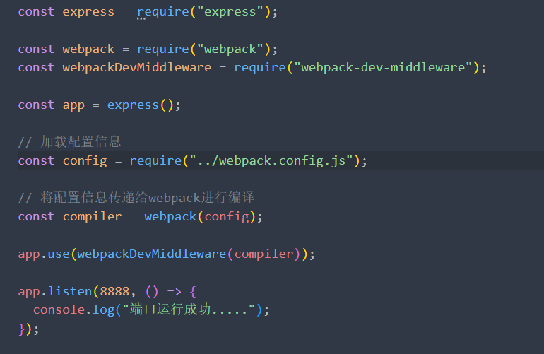
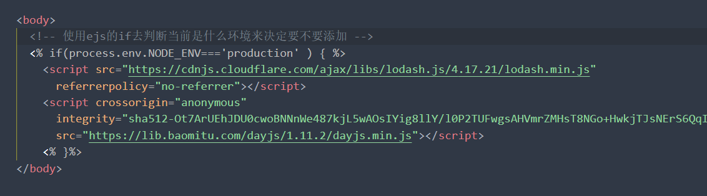

## webpack学习

> 初步准备

`npm install webpack webpack-cli -g `或`yarn add webpack webpack-cli -g`

`webpack-cli`不是必备的，也可以选择不安装， -g表示全局安装

#### 启动

输入webpack即可编译一个文件夹。但是这个webpack默认指定编译的文件是src。入口文件是src下的index.js

如果当前所需要编译的文件内的子级文件没有src或src下没有index.js都会报错


当编译完成之后，会出现一个dist的文件夹。这个文件夹内放着的就是我们被编译好的代码

> 配置局部webpack

为了让别人clone我们的代码时，所有的依赖版本一致。都应该使用局部依赖。

使用`npm init`初始化。然后在`npm install webpack webpack-cli -D`

在`package.json`内的script中配置`build`命令。

此时使用的就是局部的`webpack`了。当局部并没有webpack时。也会找到全局。

或者不配置`package.json`时。可以cd 到 node_modules的.bin下的webpack再进行打包


#### 配置

默认情况下，我们的入口文件为src下的index.js。出口文件为dist。当我们的src目录下没有index.js呢？

这个时候就会报错。我们可以通过一些指令或配置来更改这些默认的配置

`npx webpack --entry ./src/main.js --output-path ./build`：表示--entry指定入口文件。--output-path 指定出口文件

==根目录新建webpack.config.js==：通过在这个文件内配置，默认文件名为webpack.config.js

```javascript
const path = require("path");

// 采用commonJS规范
module.exports = {
// 指定入口
entry: "./src/main.js",
// 指定出口
output: {
// 指定输出的文件名
filename: "bundle.js",
// 指定输出的路径 _dirname表示绝对路径
path: path.resolve(__dirname, "./biuld"),
},
}
```

如果我们配置的文件不是叫webpack.config.js呢？

则在package.json内scripts命令内我们配置为打包的build命令内添加`--config 我们的配置文件`添加完之后就可以把我们的文件当作配置文件了

> 依赖图

那webpack怎么知道我们需要哪些，不需要哪些。他会打包哪些，不打包哪些呢？

从入口文件开始，所有存在引用关系的文件都会形成一个依赖图。而webpack会遍历这个依赖图去进行打包

而不存在这个依赖图里面的文件，则不会被打包到

> loader

在webpack内，对于一些css,less等等的模块，他是不知道怎么去对其加载的。如果我们没有配置对应的loader。则webpack会进行报错

==css-loader==

使用css-loader可以让webpack对css进行解析。`yarn add css-loader -D`进行安装

==配置方式==

1. 在引入中添加css-loader!  例如`import 'css-loader!./index.css'`
2. 在webpack配置文件中配置

```javascript
...接上代码片段
// 指定模块如何解析
  module: {
// 配置loader
rules: [
  // 配置css的loader
  {
    test: /\.css$/, // 匹配所有以.css结尾的文件
    use: [
      // webpack的执行顺序为从后往前 也就是我们这里，必须是
      // 先使用css-loader解析css文件
      // 再使用style-loader将css文件内容插入到head中
      "style-loader",
      "css-loader",
      // { loader: "css-loader" }, // 所使用的loader
    ],
  },
  // 配置less的loader
  {
    test: /\.less$/,
    use: ["style-loader", "css-loader", "less-loader"],
  },
],
},
```

配置完成之后，此时css还不能插入到我们的html文件中。还需要通过style-loader把我们的代码插入到html文件

`yarn add style-loader -D` 进行安装。

他的原理就是生成一个style标签，把css-loader所解析的代码放进去。然后在html文件的head标签内插入

==配置如上图==

#### 浏览器兼容性

在开发中，我们通常会考虑一个兼容性的问题。考虑我们的代码应该兼容哪一些浏览器

而市面上的浏览器有很多。那我们应该怎么解决这个问题呢？

> browserlist工具

通过这个工具进行配置我们所需要兼容的浏览器。

```javascript
"browserslist": [
">1%", // 表示市场占有率超过1%
"last 2 versions", // 表示兼容最近的两个大版本
"not dead" // 表示未死的，也就是24个月之内有更新的
]
```

通过以上配置就可以进行查询出满足条件的浏览器。查询用的是`caniuse-lite`工具

==配置方式==

在package.json中配置，如上代码片段

根目录新建`.browserslistrc`文件。然后进行配置

#### postcss

postcss是一个通过JavaScript来转换样式的工具。这个工具可以帮助我们进行一些css的转换和适配。比如自动添加浏览器前缀，css样式的重置等等。但是这个工具实际帮我们做的东西很少。我们还需要借助一些插件才能达到想要的效果

`postcss-cli`：可以在终端中使用postcss-cli

`autoprefixer`：帮助我们加前缀

通过`npx postcss --use autoprefixer -o result.css ./src/js/component.css`命令就能够对指定的文件进行加前缀的功能。后面的是目标文件的路径 result.css是需要输出的文件名。

但是现在这样还是不能进行webpack打包的


因为在工作中我们不可能通过终端来对每一个css文件进行加前缀之类的工作。如果css文件过多，则会变得很麻烦。我们可以通过postcss-loader让webpack对其打包的时候进行处理

`yarn add postcss-loader -D`安装后通过对`webpack.config.js`进行配置，让webpack在对css代码进行解析打包时，做一些相应的操作

```javascript
...接上webpack的配置文件
{
    loader: "postcss-loader",
    // 为这个loader进行配置
    options: {
      postcssOptions: {
        // 配置这个loader所需要的插件
        plugins: [require("autoprefixer")],
      },
    },
 },
```

当我们使用autoprefixer时，只能对属性进行一些添加前缀的工作，而我们一些属性值例如color的值的十六进制的写法。有的浏览器也是不一定支持的


此时我们可以通过`postcss-preset-env`进行转换。

`yarn add postcss-preset-env -D`后在配置autoprefixer的地方进行配置即可

```javascript
postcssOptions: {
// 配置这个loader所需要的插件
// plugins: [require("autoprefixer")],
// 简写为这种格式，因为postcss-preset-env插件默认配置了autoprefixer，所以可以省略
plugins: ["postcss-preset-env"],
},
```

配置完后可以发现，当我们在进行打包的时候已经为我们转换好了


当我们如果less也需要配置呢？那不是又要跑到less的loader配置下去输入重复的配置吗？

避免解决这个问题，我们可以在根目录建立`postcss.config.js`。然后再我们所需要使用postcss的loader里面加上`postcss-loader`即可

```javascript
postcss.config.js的配置
module.exports = {
  plugins: ["postcss-preset-env"],
};

```

如果我们在css文件内使用@import去引入css文件时会发现，引入的这个css的文件有一些需要做的处理并没有给我们处理。这是因为当我们解析css代码的时候已经走到了css-loader了。而在代码内遇到的@import，这个里面的代码不会再执行css-loader之前的loader了。所以这个引入的css文件内的代码是少了一些处理的。而我们可以通过配置`webpack.config.js`解决这个问题

```javascript
...
{
    loader: "css-loader",
    options: {
      // 表示遇到@import时，引入的文件的css代码会往前几个loader，再执行一次
      importLoaders: 1,
    },
},
```

#### 处理其他的资源

如果我们的项目中有其他的资源例如图片之类的东西。默认webpack也是不知道怎么去打包的

==file-loader==：通过这个loader进行配置，让webpack对图片也进行打包

`yarn add file-loader -D` : 安装依赖后配置`webpack.config.js`文件

```javascript
{
    test: /\.(jpg|pne?g|gif|bmp)$/,
    use: "file-loader",
},
```

> 打包之后的命名

当我们进行了打包之后，文件的命名默认是32个字符的hash值。而如果我们想要对比一下打包前后的图片时，不容易找到，那我们应该怎么让他在打包时，保留原来的命名呢?

可以通过配置loader的options配置

```javascript
{
    loader: "file-loader",
    options: {
      // 图片输出的名称 [name]表示原来的名称 [ext]表示原来的后缀 [hash:6]表示图片的hash值,取前六位
      name: "img/[name].[hash:6].[ext]",
      // 图片输出的路径
      // outputPath: "img",
    },
},
```

> url-loader

如果我们大小图片都进行打包到文件内，则对于小图片来说，则会增加很多不必要的http请求。我们可以通过url-loader来进行打包图片，通过设置`limit`来限制超过了多少kb的图片则打包到build里面。如果没有超过则打包为base64嵌入到js文件内，这样就不用发起请求了。也减少了服务器的压力

`yarn add url-loader -D`安装依赖

```javascript
{
    loader: "url-loader",
    options: {
      // 图片输出的名称 [name]表示原来的名称 [ext]表示原来的后缀 [hash:6]表示图片的hash值,取前六位
      name: "img/[name].[hash:6].[ext]",
      // 图片输出的路径
      // outputPath: "img",
      // 小于100kb的图片则转换成base64 大于100kb的图片则转换成url
      limit: 100 * 1024,
    },
  },
```

可以根据需求来进行设置图片的大小

#### asset module type

在webpack5之前，加载这些资源需要使用一些相关的loader。而在webpack5之后，我们可以直接使用资源模块类型(asset module type)来代替这些loader

`asset/resource`：发送一个单独的文件并导出URL，之前通过file-loader实现

`asset/inline`：导出一个资源的data URL。之前通过url-loader实现

`asset/source`：导出资源的源代码。之前通过使用raw-loader(css-loader)实现

`asset`：根据图片的大小来选择是导出一个单独的文件，还是导出一个资源的data URL

> asset/resource

通过配置`webpack.config.js`：实现file-loader的功能

```javascript
...
{
	test: /\.(jpg|pne?g|gif|bmp)$/,
	type: "asset/resource",
},
```


如果想要自定义的文件的输出路径和文件名

```javascript
{
  test: /\.(jpg|pne?g|gif|bmp)$/,
  type: "asset/resource",
  // 配置自定义导出文件和文件名
  generator: {
    filename: "img/[name][hash:6][ext]",
  },
},
或在output配置中配置
assetModuleFilename: "img/[name][hash:6][ext]"
```

> asset

```javascript
{
    test: /\.(jpg|pne?g|gif|bmp)$/,
    type: "asset",
    // 设置导出路径及文件名
    generator: {
      filename: "img/[name][hash:6][ext]",
    },
    // 设置图片应该是转为base64的大小还是转为URL的资源
    parser: {
      dataUrlCondition: {
        maxSize: 100 * 1024,
      },
    },
 },
```

==需要打包字体图标用法也是一致的==

#### plugin

现在我们进行重新打包的时候都是需要手动删除打包后的文件，然后再进行打包。这样打包出来的代码才是最新的。但是每次进行打包之前都需要手动删除一下build文件。这样是很麻烦的。我们可以通过plugin来进行自动给我们替换为最新的代码。

==loader用于特定的模块类型继续转换，而plugin可以用于执行跟广泛的任务。比如打包优化，资源管理，环境变量注入等等==。而我们这种场景可以使用`clean-webpack-plugin`

> clean-webpack-plugin

打包时，自动把原本的打包文件替换为最新的

```javascript
const { CleanWebpackPlugin } = require("clean-webpack-plugin");

module.exprts = {
    plugins: [new CleanWebpackPlugin()]
}
```

配置完成之后我们每次打包就不需要手动删除打包之后的文件了

> html-webpack-plugin

目前我们所打包的文件内都是没有index.html的，也就是我们打包过后的文件是不能运行的，虽然我们可以手动的添加一个html文件，但是每次打包过后都添加一次，也会显得特别的麻烦。==此时html-webpack-plugin==就可以做这样一件事，可以自动生成一个html文件，并把我们打包完成的js文件引入

`yarn add html-webpack-plugin`，安装完后

```javascript
const HtmlWebpackPlugin = require("html-webpack-plugin");

moudle.exports = {
		plugins: [
    new CleanWebpackPlugin(),
    // 配置自动生成index.html
    new HtmlWebpackPlugin({
      // 配置生成的index.html 的title
      title: "hwh webpack",
      // 我们可以指定html模板让它自动去生成一个这样的模板
      template: "public/index.html",
    }),
  ],
}
```

他的工作原理是通过一个ejs的文件的模板去生成的，但是有的时候我们不想要它的模板时，可以自己指定一个模板去生成

> DefinePlugin

在我们自定义的模板中，link中引入了一个icon图标。而这个图标的路径是用一个变量来定义的


也就是说我们得有这个全局变量，否则打包的时候就会报错，我们可以通过webpack内输出的一个DefinePlugin内配置全局变量

而我们在打包时，有一些文件是想要webpack直接复制到我们打包好的文件内的，可以通过`copy-webpack-plugin`进行打包复制文件。

```javascript
const { DefinePlugin } = require("webpack");
const CopyWebpackPlugin = require("copy-webpack-plugin");

module.exports = {
    plugins: [
        // 定义全局变量
        new DefinePlugin({
          BASE_URL: '"./"',
        }),
        // 复制文件
        new CopyWebpackPlugin({
          patterns: [
            {
              from: "public",
              // 筛选文件 from下的被ignore的文件不会被复制
              globOptions: {
                ignore: ["**/index.html"],
              },
            },
          ],
        }),
    ]
}

```

#### mode

mode的配置，默认是`production`：生产环境，此时打包出来的build文件是经过丑化的。不容易看懂的代码

`development`：开发环境，此时build文件内的代码是比较易读的

CommonJs打包后的源码：`见06_webpack模块化原理下CommonJS下的build.js`

EsModule打包后的源码:`见06_webpack模块化原理下EsModule下的build.js`

#### source-map

我们的代码运行在浏览器上时，通常都是被打包过的，也就是真实跑在浏览器上的代码，与我们编写的源代码是有差异的。比如ES6的代码被转换为ES5的代码。比如代码进行了丑化之类的。

而如果我们的代码在打包运行时，出错了是很难找到出错的位置的，因为浏览器运行的代码并不是我们编写的源代码。


那我们怎么可以让打包过后运行在浏览器的代码与我们编写的代码保持一致呢？==通过source-map可以做到==

它会把已转换的代码，映射到原始的文件，使得浏览器可以重构原始源，并在调试器中显示重建的原始源

通过devtool不同的属性值会做相应的措施

怎么使用source-map呢？

通过生成的source.map文件，在转换的build.js文件内最后一行添加一个注释

`//# sourceMappingURL=common.bundle.js.map`指向这个source-map文件。浏览器会根据注释，查找对应的source-map文件，并根据这个文件还原我们的代码。方便进行调试

生成的source-map文件是会比源文件大的，因此我们可以根据需求设置不同的`devtool`属性值，做出相应的优化

==source-map文件的解析==

`version`：当前使用的版本

`sources`：从哪些文件转换过来的

`names`：转换前的变量和属性名称

`mappings`：source-map用来和源文件映射的信息，一串base64 VLQ编码

`file`：打包后的文件

`sourceContext`：转换前的具体代码信息

`sourceRoot`：所有的sources相对的根目录

> source-map值的解析

`false`：不生成source-map文件

`none`：production模式下的默认值，不生成source-map

`eval`：不生成source-map文件，但是会生成一些对应的文件目录，内的代码与我们的源代码差异很大

`source-map`：生成source-map文件，在build.js文件内有一个注释，指向这个source-map文件

`eval-source-map`：会生成source-map，但是source-map是以DataUrl添加到==eval函数后面的==。不是一个单独的文件

`inline-source-map`：会生成source-map，但是source-map是以DataUrl添加到==build文件后面的==。不是一个单独的文件

`cheap-source-map`：会生成source-map，但是会更加高效，因为如果有报错，他是定义到行的，而正常source-map是定义到列的(准确到是哪一个变量或属性方法出错)

`cheap-module-source-map`：会生成source-map，但对源代码处理会更好。例如我们有一些js文件是使用babel的loader进行转换过再生成的source-map。而使用`cheap-source-map`映射出来的source-map跟我们的源代码会有出入。而`cheap-module-source-map`就不会

`hidden-source-map`：会生成source-map，但是不会对source-map文件进行引用；相当于删除了打包文件中对source-map的引用注释

`nosources-source-map`：会生成sourcemap，但是生成的sourcemap只有错误信息的提示，不会生成源代码文件

**那么在开发中，最佳的实践是什么呢？**

 开发阶段：推荐使用 source-map或者cheap-module-source-map

​						 这分别是vue和react使用的值，可以获取调试信息，方便快速开发；

 测试阶段：推荐使用 source-map或者cheap-module-source-map

​						测试阶段我们也希望在浏览器下看到正确的错误提示；

 发布阶段：false、缺省值（不写）

#### babel

为什么需要babel呢？

在我们的JavaScript中，不是所有的浏览器都会支持新特性，有的浏览器是不兼容ES6的语法的，但是我们也不能把我们的每一句代码都手动进行转换为ES5之前的代码。而babel可以帮助我们进行这以一工作

> 命令行使用babel

babel不一定需要webpack等工具一起配合使用，也可以单独使用

@babel/core：babel的核心代码，必须安装；

@babel/cli：可以让我们在命令行使用babel；

`npm install @babel/cli @babel/core`

使用babel来处理我们的源代码：

src：是源文件的目录；

--out-dir：指定要输出的文件夹dist；

`npx babel src --out-dir dist`

> babel插件的使用

比如我们需要转换箭头函数，那么我们就可以使用箭头函数转换相关的插件：

`npm install @babel/plugin-transform-arrow-functions -D`

`npx babel src --out-dir dist --plugins=@babel/plugin-transform-arrow-functions`

查看转换后的结果：我们会发现 const 并没有转成 var

这是因为 `plugin-transform-arrow-functions`，并没有提供这样的功能；

我们需要使用 `plugin-transform-block-scoping` 来完成这样的功能；

`npm install @babel/plugin-transform-block-scoping -D `

`npx babel src --out-dir dist --plugins=@babel/plugin-transform-block-scoping@babel/plugin-transform-arrow-functions`

但是如果要转换的内容过多，一个个设置是比较麻烦的，我们可以使用预设（preset）

安装@babel/preset-env预设：

`npm install @babel/preset-env -D `

执行命令：`npx babel src --out-dir dist --presets=@babel/preset-env`

> babel的执行原理


>  配置babel

在工作中，我们不可能使用命令行来使用babel进行编译。我们可以通过webpack的loader再我们进行打包的时候进行编译

`yarn add babel-loader @babel/core`安装后，在webpack内进行配置。一般我们都会使用预设来加载对应的插件列表，并且将其传递给babel。`yarn add @babel/preset-env`预设会根据我们的js代码用到对应的插件。这样避免管理很多的插件的问题

```javascript
module: {
    rules: [
      {
        test: /\.js$/,
        exclude: /node_modules/, // 排除哪些文件
        use: {"babel-loader",
        // options: {
        // 通过插件的方式让其js文件转换成我们想要的代码
        // plugins: [
        //   "@babel/plugin-transform-block-scoping",
        //   "@babel/plugin-transform-arrow-functions",
        // ],
        // 通过预设的方式来转换，这样不用下载大量的插件来进行转换
        // presets: ["@babel/preset-env"],
        // },
         }
      },
    ],
  },
```

我们最终打包的js代码是要跑在浏览器上的，那么如何告知babel我们需要适配的浏览器呢？

可以通过browserslist，或者targets属性

==browserslist==：可以在根目录新建一个.browserslistrc文件，然后再里面配置或者在package.json内使用`browserslist`属性配置


==targets属性==


#### polyfill

polyfill是什么呢？

比如我们在js代码中使用了一些语法特性，例如promise和Generator，async await之类的。通过babel转换之后也是无法进行转换的。但是有的低版本的浏览器又不支持这种语法时。就可以使用polyfill进行打补丁(转换)

`yarn add core-js regenerator-runtime`安装，然后进行配置(在babel-loader的这个loader上设置exclude筛选不需要打补丁的文件)

==注：以下配置是在根目录新建babel.config.js配置的，当我们需要编译的文件太多时，也可以通过这种方式进行配置==

```javascript
module.exports = {
  presets: [
    [
      "@babel/preset-env",
      {
        //设置以什么样的方式来使用polyfill
        useBuiltIns: "usage",
        // 指定corejs版本
        corejs: 3,
      },
    ],
  ],
};
```

> useBuiltIns属性值

==false==

​		打包后的文件不使用polyfill来进行适配；

​		并且这个时候是不需要设置corejs属性的；

==usage==

​		会根据源代码中出现的语言特性，自动检测所需要的polyfill； 

​		这样可以确保最终包里的polyfill数量的最小化，打包的包相对会小一些；

==entry==

​			如果我们依赖的某一个库本身使用了某些polyfill的特性，但是因为我们使用的是usage，所以之后用户浏览器			可能会报错； 

​			所以，如果你担心出现这种情况，可以使用 entry； 

​			并且需要在入口文件中添加 **`import 'core-js/stable'; import 'regenerator-runtime/runtime';**

​			这样做会根据 browserslist 目标导入所有的polyfill，但是对应的包也会变大；

> Plugin-transform-runtime

在我们使用`regenerator-runtime`来进行polyfill。默认情况下，添加的所有的特性都是全局的，如果我们正在编写一个工具库是，肯定是不希望污染用户的代码的。而这个时候就可以使用这个插件来完成polyfill功能。它新增的特性都是局部的


#### 编译typescript

我们在开发中，ts代码是需要编译成js代码才能运行的。`yarn add typescript -D`安装ts。

编译ts需要一个配置文件，可以`npx tsc --init`自动生成。此时就可以使用`npx tsc './src/index.ts'`进行编译了。但是在项目中，我们编写的ts文件有很多，所以不可能每一个文件都在终端输入命令去编译。

此时可以使用ts-loader来进行编译

> ts-loader

`yarn add ts-loader -D`安装这个loader，然后在`webpack.config.js`中对loader进行对应的配置。

```javascript
{
    test: /\.ts$/,
    exclude: /node_modules/,
    use: "ts-loader",
 },
```

之后就可以通过`yarn run build`命令进行打包了

> babel-loader

除了可以使用ts-loader进行编译外，也可以使用babe-loader进行编译

使用Babel进行时需要`yarn add @babel/perset-typescript -D`安装这个预设，让babel对于ts文件也能进行polyfill

安装完后配置`babel.config.js`文件

```javascript
module.exports = {
  presets: [
    [
      "@babel/preset-env",
      {
        useBuiltIns: "usage",
        corejs: 3,
      },
    ],
    ["@babel/preset-typescript"],
  ],
};
```

并配置`webpack.config.js`文件

```javascript
{
    test: /\.ts$/,
    exclude: /node_modules/,
    use: "babel-loader",
 },
```

配置完后通过`yarn run build`即可打包

==两个loader的优缺点==

`ts-loader`：在编译ts文件时可以做类型检查，也就是当我们的类型有错时，不会打包，会在控制台报错。但是他不会进行polyfill。也就是对于一些新特性不会进行打补丁

`babel-loader`：在编译ts文件不会做类型检测，即使类型有问题。也不会报错，但是可以进行polyfill

==开发中应该选择哪一个呢？==

在开发中我们可以配置一个脚本，让我们在编写代码时可以直接进行类型检测。而打包时使用`babel-loader`。


`--watch`,可以在我们每次编写完代码就进行类型检测，`--noEmit`表示不需要生成文件。而我们在编写代码时使用tsc进行类型检测。需要打包时在使用`babel-loader`

#### 搭建本地服务

目前我们开发的代码说需要先build进行打包，然后再通过live serve打开index.html进行运行的。但是频繁的打包会影响我们开发的效率。由此，我们希望可以做到，当文件变化时，可以自动的完成编译和展示；

为了完成自动编译，webpack提供了几种可选的方式

> webpack watch mode

在该模式下，webpack依赖图中的所有文件，只要有一个发生了改变，那么代码会重新进行编译

==开启方式==

1. 在`webpack.config.js`配置中，添加`watch:true`

   

2. 在`package.json`的webpack启动脚本中添加`--watch`

   

> webpack-dev-server

上面的方式可以监听到文件的变化，但是事实上它本身是没有刷新浏览器的功能的，而我们需要在模块发生变更时，会自动给我们实时重载

`yarn add webpack-dev-server -D`安装这一插件，然后添加一个新的脚本


当我们输入`yarn run serve`时，不会输出build这个这个打包文件，而是将build文件保存在内存中，当我们模块发生变更时，就会重新进行打包，并刷新浏览器

> webpack-dev-middleware

默认情况下，我们使用webpack-dev-server是已经够用了，但是如果我们想要更好的自由度，可以使用webpack-dev-middleware。

它是一个封装器，可以把webpack处理过的文件发送到一个server中。这个server可以根据我们自己的需求去自定义



#### HMR

什么是HMR呢？

称之为模块热更新。指的是程序在运行过程中，替换，添加，删除模块，而无需重新刷新整个页面

HMR通过一下几种方式，来提高开发的速度

1. 不重新加载整个页面，这样可以保留某些应用程序的状态不丢失
2. 只更新需要变化的内容，节省开发时间
3. 修改了css,js源代码，会立即在浏览器更新，相当于直接在浏览器的控制台直接修改样式

> 使用HMR

默认情况下，`webpack-dev-server`已经支持了HMR。我们只需要开启即可

在不开启的情况下，当我们修改了源代码之后，整个页面会自动刷新

而我们开启之后，更改内容不会触发浏览器刷新，而是只更新更改部分的内容


`webpack.config.js`配置以上属性，并且在文件的根目录上配置


配置完成后，当我们监听的模块的依赖图有发生改变时，就会自动更新对应的内容

> 在react中使用


> HMR的原理

webpack-dev-server会创建两个服务：提供静态资源的服务(express)和Socket服务

express server负责直接提供静态资源的服务(打包后的资源直接被浏览器请求和解析)

HMR Socket Server是一个socket的长连接

长连接有一个最好的好处就是建立连接后双方可以通信(服务器直接可以发送文件到客户端,双向通信)

当服务器监听到对应的模块发生变化时，会生成两个文件.json文件(通过hash存放更新的位置)和.js文件(存放更新的内容)

通过长连接，可以直接将这两个文件主动发送给客户端(浏览器)

浏览器拿到两个新的文件后，通过HMR runtime机制，加载这两个文件，并且针对修改的模块进行更新


=======
#### 路径解析

==output的publicPath==

在output中有一个path属性，他的作用是用于告诉webpack，我们打包好的文件输出在哪里，而publicPath的属性是指定打包后的index.html文件内引用build.js的一个路径。默认是""。也就是当我们打包完成后，index.html里的script标签的src为`<script src='/build.js'></script>`。它的src是由output.publicPath + build.js拼接成的。所以如果publicPath设置有值的话，会被拼接上去


==devServer下static的publicPath==

在devServer下的中static也有一个publicPath的属性。改属性指的是本地服务所在的文件夹。

默认值是/  也就是我们直接访问访问http://localhost:3000就能访问到资源。但是如果设置了值的话，我们在访问时，就必须加上publicPath这个值。否则访问不到。如果设置了这个值，output的publicPath应该与它一致


==devServer下static的directory==

directory用来开发时加载静态资源，例如我们有一些图片，需要在某一个组件内引用。此时就可以使用到这个配置。而watch配置可以监听directory内的资源，如果发生改变就会刷新浏览器

`如上图`

> devserver的一些其他配置

==port==：设置监听的端口，默认是8080

==open==：启动服务时是否打开浏览器，可以设置布尔值，也可以设置浏览器名

==compress==：是否为静态文件开启压缩，也就是文件在请求过程中是否需要被压缩

> devserver的proxy

在开发中我们常会遇到一些跨域问题，当时解决的方法有很多。但是我们也可以通过devserver来配置代理解决跨域问题

```javascript
.....
proxy: {
    // 可以直接设置我们需要请求的地址，但是这类方法最后请求时会把/hwh也加进去
  // "/hwh": "http://localhost:8888"
    // 以下配置方法
    // target是需要请求的地址
    // pathRewrite会匹配到地址中/hwh开头的字符，并替换为 ''
  "/hwh": {
    target: "http://localhost:8888",
    pathRewrite: {
      "^/hwh": ""
    },
    // 默认情况下，我们不能发送https的请求，可以通过secure设置为true时，没有证书也能发送https请求
    secure: false,
    // 这个匹配的主要作用是用于，如果服务器有验证则会验证我们代理之前的地址，也就是存在跨域问题的地址
    // 那么就会无法发送请求。而通过changeOrigin配置设置，则可以把我们代理之前的地址更新为代理的地址
    // webpack5中不存在这一属性
    changeOrigin: true
  }
},
```

> **historyApiFallback**

historyApiFallback是开发中一个非常常见的属性，它主要的作用是解决SPA页面在路由跳转之后，进行页面刷新

时，返回404的错误。 

boolean值：默认是false

如果设置为true，那么在刷新时，返回404错误时，会自动返回 index.html 的内容； 

object类型的值，可以配置rewrites属性： 

可以配置from来匹配路径，决定要跳转到哪一个页面；

事实上devServer中实现historyApiFallback功能是通过connect-history-api-fallback库的：

可以查看connect-history-api-fallback 文档

#### resolve模块解析

resolve用于设置模块如何被解析：

​			在开发中我们会有各种各样的模块依赖，这些模块可能来自于自己编写的代码，也可能来自第三方库；

​			resolve可以帮助webpack从每个 require/import 语句中，找到需要引入到合适的模块代码；

​			webpack 使用 enhanced-resolve 来解析文件路径；

**webpack能解析三种文件路径：**

绝对路径

​		由于已经获得文件的绝对路径，因此不需要再做进一步解析。

相对路径

​		在这种情况下，使用 import 或 require 的资源文件所处的目录，被认为是上下文目录；

​		在 import/require 中给定的相对路径，会拼接此上下文路径，来生成模块的绝对路径；

模块路径

​		在 resolve.modules中指定的所有目录检索模块；

默认值是 ['node_modules']，所以默认会从node_modules中查找文件；

我们可以通过设置别名的方式来替换初识模块路径

> **extensions**设置

在项目中，我们在引入一个模块时，通常不会去输入他的后缀名。这是因为配置了extensions。但是他的默认值是 ['.wasm', '.mjs', '.js', '.json']；如果我们需要配置其他的后缀名，则需要把原来的默认值也写上，否则默认值会失效

另一个非常好用的功能是配置别名alias： 

​		特别是当我们项目的目录结构比较深的时候，或者一个文件的路径可能需要 ../../../这种路径片段； 

​		我们可以给某些常见的路径起一个别名；


#### 环境分离

在开发中，当我们的webpack.config.js中的配置信息太多了的时候，这个文件会变得越来越不好维护。并且有一些文件是开发时需要，有一些文件时生产时需要。还有一些是在开发和生产都需要的配置。

所以，一般情况下。我们在工作中，最好是对配置进行划分。方便我们维护和管理

> ### 方案一

编写两个不同的配置文件，开发和生产时，通过不同的脚本进行加载不同的配置文件即可


> ### 方案二

使用同一个配置文件，通过在脚本中设置参数来区分他们


在webpack.common.js文件内，暴露一个函数，这个函数会接收一个参数。通过这个参数来判断当前是什么环境


生产环境时，最后一个参数为production:true。而在开发环境时为development：true。

而我们可以在配置文件中去判断这个参数。

```javascript
const path = require("path");

module.exports = function (env) {
  console.log("-----", env);

  return {
    //context的作用用于解析入口和加载器(loader)
    // 默认是当前的根路径
    // 如果有配置这个属性的话，就变为了当前配置文件所在的路径
    context: path.resolve(__dirname, "./"),
    entry: "../src/js/main.js",
    output: {
      filename: "bundle.js",
      path: path.resolve(__dirname, "../build"),
    },
  };
};
```

==具体可见代码12_webpack环境分离==

#### 代码分离

它的主要目的是将代码分离到不同的build文件中，之后我们可以按需加载，或者并行加载这些文件

比如默认情况下，所有的js代码在首页全部都加载，就会影响首页的加载速度。

代码分离可以分出更小的build。

使用webpack分离有三种方式

> **入口起点**

我们可以配置多个入口起点。

```javascript
  // 使用多入口的方式可以对代码进行抽离
  entry: {
    // 匹配main.js文件为入口
    main: "./src/js/main",
    // 匹配index.js文件为入口
    index: "./src/index",
  },
   output: {
    // [name] 打包输出时保留入口文件的文件名
    filename: "[name].bundle.js",
    path: resolveApp("./build"),
  },
  当我们打包的时候就会出现main.build.js和index.build.js
```

这种方式比较简单，但是如果这两个文件都引用了相同的代码时，他们都会去打包。这样会造成代码重复

> **Entry Dependencies(入口依赖)**

如果在多个文件中，都引用了一些相同的库或者组件时。可以使用这种方法

```javascript
entry: {
    // 以对象的形式配置入口
    index: { import: "./src/index.js", dependOn: "shared" },
    main: { import: "./src/js/main.js", dependOn: "shared" },
    // 把代码引入的共同文件都放在这里
    shared: ["lodash"],
  },
output: {
  // [name] 打包输出时保留入口文件的文件名
  filename: "[name].bundle.js",
  path: resolveApp("./build"),
},
```

这种方法，开发时并不推荐。

> **splitChunks**

这种方式是使用的SplitChunkPlugin来实现的。webpack已经默认安装和集成该插件。所以我们并不需要单独安装

只需要为该插件提供配置即可

```javascript
entry: {
  // 匹配main.js文件为入口
  main: "./src/js/main",
  // 匹配index.js文件为入口
  index: "./src/index",
 },
output: {
  // [name] 打包输出时保留入口文件的文件名
  filename: "[name].bundle.js",
  path: resolveApp("./build"),
},
  //配置在这个属性内
 optimization: {
    splitChunks: {
      chunks: "all",
    },
  },
```

==chunks==有三个值，async异步请求。例如我们import导入方式是`import("lodash").then(res => {})`这种方式就是异步的。而值为`async`时，只处理异步的。`initial`处理同步，默认的import导入都是同步的。`all`为都处理

使用这种方式打包后会多出几个文件。txt文件为注释文件。486.build.js文件为代码公共部分


> **具体的配置信息**

```javascript
// 使用多入口的方式可以对代码进行抽离
  entry: {
    // 匹配main.js文件为入口
    main: "./src/js/main",
    // 匹配index.js文件为入口
    index: "./src/index",
    // index: { import: "./src/index.js", dependOn: "shared" },
    // main: { import: "./src/js/main.js", dependOn: "shared" },
    // shared: ["lodash"],
  },
  output: {
    // [name] 打包输出时保留入口文件的文件名
    filename: "[name].bundle.js",
    path: resolveApp("./build"),
    // 异步引入的文件，会自动打包一个文件。这个属性用于设置它打包后的name。便于区分
    // 默认情况下，这个id和name打包出来是一致的，如果我们希望修改的话，可以在引入时使用魔法注释来设置
    chunkFilename: "chunk_[id]_[name].js",
  },
  optimization: {
    splitChunks: {
      // 不管我们这里设置的是什么，在代码中，如果有异步引入。默认还是会单独打包文件的
      chunks: "all",
      // 如果一个包的大小小于这个属性的值，那就不会进行拆分
      minSize: 100,
      // 将大于maxSize的包拆分成不小于minSize的包
      maxSize: 200,
      // 用于对拆分的包进行分组，也就是我们可以匹配指定的文件
      // 然后再进行单独的打包
      cacheGroups: {
        // 这个键名是自定义的
        foo: {
          test: /foo/,
          filename: "foo_[id].[hash:6].js",
          // 配置优先级，如果有多个的时候，会根据优先级进行拆分
          priority: -10,
        },
      },
      // 至少被引入的次数 如果引入的次数不超过这个值，就不会拆分
      // 但是如果这个包大于了maxSize，那就会拆分，拆分的条件不是按照cacheGroups的条件
      minChunks: 1,
      // 最大异步请求数量
      maxAsyncRequests: 30,
    },
    // 用于配置告诉webpack模块的id采用什么算法生成
    // natural：按照数字的顺序使用id(不推荐)
    // named 开发时的默认值，一个可读名称的id(开发时推荐)
    // deterministic 确定性的id，在不同的编译中，使用不同的短数字(打包时推荐)
    chunkIds: "deterministic",
  },
  resolve: {
    extensions: ["*", ".js", ".jsx", ".json"],
  },
  plugins: [
    new HtmlWebpackPlugin({
      title: "hwh webpack",
      template: "./index.html",
    }),
  ],
```

异步导入的魔法注释


> optimization.runtimeChunk配置

配置runtime相关的代码是否抽取到一个单独的chunk中：

​			runtime相关的代码指的是在运行环境中，对模块进行解析、加载、模块信息相关的代码；

​			比如我们的component、bar两个通过import函数相关的代码加载，就是通过runtime代码完成的；

抽离出来后，有利于浏览器缓存的策略： 

​		比如我们修改了业务代码（main），那么runtime和component、bar的chunk是不需要重新加载的；

​		比如我们修改了component、bar的代码，那么main中的代码是不需要重新加载的；

设置的值：

​		true/multiple：针对每个入口打包一个runtime文件；

​		single：打包一个runtime文件；

​		对象：name属性决定runtimeChunk的名称；

#### CDN

CDN称之为内容分发网络，它是指通过相互连接的网络系统，利用最靠近每个用户的服务器。把静态资源发送给用户。来提高性能，可扩展性及低成本

在开发中，我们使用CDN主要有两种方式

方式一：打包所有的静态资源，放到CDN服务器，用户所有的资源都是通过CDN服务器加载的

方式二：一些第三方资源放到CDN服务器上

==如果我们自己有服务器==：则把output的publicPath设置为我们自己的CDN服务器的地址

==使用第三方的CDN服务器==：一些第三方库中，在bootcdn这个网站都能找到他们的CDN服务器的地址。而我们可以通过配置让这个三方库使用CDN服务器进行加载。在webpack的配置文件配置以下属性，并在我们的模板index.html中配置scrip标签。src属性为对应的库的CDN地址

```javascript
// 需要使用CDN的第三方库
externals: {
   // key是库名，value是这个库的顶级对象
   dayjs: "dayjs",
},
    
```

但是我们这个配置，在开发环境是不需要的，本来开发环境下，已经够快了。所以这个配置在我们生产环境下的webpack配置文件内

而在模板中，我们使用ejs的if去判断当前的script需不需要添加



#### css代码抽离

在开发中，我们一般在项目未打包的时候，对于解析css文件，是把它插入到`head`标签内的`style`标签的。但是在生产环境中，我们需要把css文件单独抽离出来打包为一个文件。此时可以使用`mini-css-extract-plugin`这个插件帮助我们完成这件事。


> **Hash,ContextHash,ChunkHash**

在我们给打包的文件进行命名的时候，会使用placeholder，placeholder中有几个属性比较相似：

​		hash、chunkhash、contenthash

​		hash本身是通过MD4的散列函数处理后，生成一个128位的hash值（32个十六进制）；

hash值的生成和整个项目有关系：

​		比如我们现在有两个入口index.js和main.js； 

​		它们分别会输出到不同的bundle文件中，并且在文件名称中我们有使用hash； 

​		这个时候，如果修改了index.js文件中的内容，那么hash会发生变化；

​		那就意味着两个文件的名称都会发生变化；

chunkhash可以有效的解决上面的问题，它会根据不同的入口进行借来解析来生成hash值：

​		比如我们修改了index.js，那么main.js的chunkhash是不会发生改变的； 

contenthash表示生成的文件hash名称，只和内容有关系：

​		比如我们的index.js，引入了一个style.css，style.css有被抽取到一个独立的css文件中；

​		这个css文件在命名时，如果我们使用的是chunkhash； 

​		那么当index.js文件的内容发生变化时，css文件的命名也会发生变化；

​		这个时候我们可以使用contenthash；

#### DLL

DLL是动态连接库，是为软件再windows实现共享函数库的一种实现方式，比如一些第三方的库，需要在多个组件引入。而我们打包时，并不想每次都打包。消耗性能。

而在webpack中也有内置DLL的功能，它指的是==我们将可以共享，并且不经常改变的代码，抽取成一个共享的库==。这个库在之后的编译过程中，会被引入到其他项目的代码中

DLL库的使用分为两步，

1. 打包一个DLL库
2. 项目中引入DLL库

> **打包一个DLL库**


打包完成后可以直接把这个文件夹复制到我们的项目中

> 使用这个DLL库

 

例如这样配置即可完成

#### Terser

什么是Terser？

​		是一个JavaScript的解释，压缩的工具集

我们在生产环境下打包完成的代码都是被丑化压缩过的代码。而webpack内正是使用的Terser进行压缩的

它是一个独立的工具，可以单独安装

`yarn add terser -g`  || `yarn add terser`

在独立使用中，可以使用命令行来进行使用。他们的配置有很多，具体可查看文档

https://github.com/terser/terser#compress-options

https://github.com/terser/terser#mangle-options

在webpack中使用：默认webpack已经配置好了这类东西的配置。如果这个配置无法满足我们的需求的时候，可以在webpack的`optimization.minimizer`配置中进行相关操作

#### css的压缩

css压缩通常是去除无用空格，因为很难去修改选择器，属性的名称，值等等

对于css的压缩可以使用：css-minimizer-webpack-plugin插件

`yarn add css-minimizer-webpack-plugin`安装

在optimization.minimizer中配置


#### scope Hoisting

这个功能是对作用域进行提升，并且让webpack打包后代码更小，运行更快

默认情况下webpack打包会有很多的函数作用域，包括一些最外层的立即执行函数之类的。而它的作用就是把一些函数提升到顶层直接调用，就不会存在多个地方进行引用，导致的性能问题

而在webpack的production中，默认是开启的，如果在开发环境中，我们也想去使用的话，则在webpack的plugins配置中配置


#### Tree Shaking

在我们项目中难免会有一些写了但是没有用到代码，而把这些代码打包在内会影响内存。而tree Shaking可以消除我们在项目中定义了但是没有使用的代码

> usedExports

通过标记某些函数是否被使用，之后通过Terser进行优化

mode设置为development时，默认就会开启usedExports


在optimization中设置，但是设置了这个属性，也只是会在没有使用过的函数前通过注释去标记而已。真正的优化还需要配置minimize和minimizer属性进行优化

> sideEffects

通过在package.json中配置，可以是布尔值，也可以是数组。如果为布尔值时，则告诉webpack这些未使用的export都是有副作用的，不能删。为false时，则没有副作用，可以删。是一个数组时，则告诉webpack，这个数组内的文件都是有副作用的，不能删，其他的可以

对于css的文件。可以在匹配css文件的loader中，添加sideEffects属性，表示所有的css文件都是有副作用的

#### css的tree Shaking

上面的tree Shaking只能是对js进行优化，而css文件内，有一些没有使用到的样式。我们应该也要进行优化

使用PurgeCss可以对css样式进行优化。

`yarn add purgecss-webpack-plugin`安装插件，并需要用到glob这个插件。默认webpack内置是有这个插件的。


#### webpack对HTTP的压缩

HTTP压缩是一种内置在服务器和客户端之间的，以改进传输速度和带宽利用率的方式

HTTP压缩的流程是什么呢？

1. HTTP数据在服务器发送前就已经被压缩了。这个可以在webpack中完成
2. 兼容的浏览器在向服务器发送请求时，会告知服务器自己支持哪些压缩格式：在请求报文的`Accept-Encoding`字段内
3. 服务器在浏览器支持的压缩格式下，直接返回对应的压缩后的文件，并且在响应头中告知浏览器。在`Content-Encoding`字段

目前使用较多的压缩格式有gzip和deflate，br的压缩格式有一些浏览器还不兼容

> #### webpack对文件的压缩

`yarn add compresstion-webpack-plugin`安装依赖,引入后配置


> **对于HTML文件中的代码的压缩**

在HtmlWebpackPlugin插件中，除了template属性外，还有很多对于html文件内的代码进行压缩的配置

